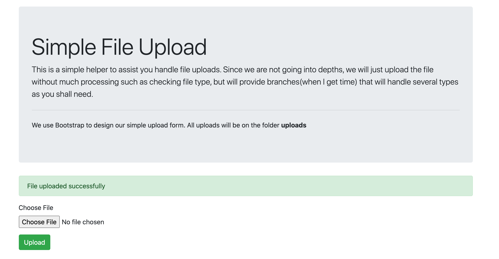

### Simple PHP File Upload
This is a simple helper to assist you handle file uploads.



Since we are not going into depths, we will just upload the file without
much processing such as checking file type, but will provide branches(when I get time)
that will handle several types as you shall need.

We use Bootstrap to design our simple upload form. All uploads will be on the folder ```uploads```

